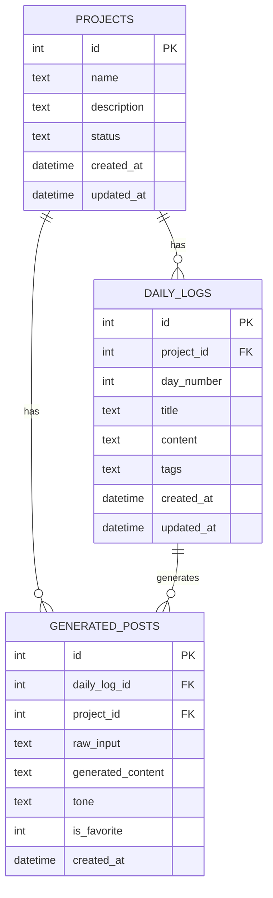

<p align="center">
  
</p>

<h1 align="center">PostUp ✍️</h1>

<p align="center">
  <strong>Your personal AI-powered LinkedIn post writer.</strong><br/>
  Transform daily tasks, learnings, and project milestones into polished LinkedIn posts — effortlessly.
</p>

<p align="center">
  
  
  
  
  
  
</p>

---

## 🎯 What is PostUp?

PostUp is a **personal-use** LinkedIn post writing tool that takes your raw notes about daily work, learnings, or completed projects and generates **professionally crafted LinkedIn posts** using Google's Gemini AI.

**This app is built with one singular focus: writing LinkedIn posts. Nothing else.**

### The Problem

You finish a productive day of coding, learning, or building — but turning that into a compelling LinkedIn post takes another 30 minutes of writing, formatting, and overthinking.

### The Solution

Write what you did in plain language → PostUp generates a scroll-stopping LinkedIn post in seconds.

---

## ✨ Features

### 📝 AI-Powered Post Generation
- Write raw notes about your day → get a polished LinkedIn post
- **4 Tone Modes**: Professional, Casual, Storytelling, Motivational
- Regenerate with feedback — tell the AI what to change
- LinkedIn best practices baked in (hooks, formatting, hashtags, CTAs)

### 📁 Project Tracking
- Create dedicated projects (e.g., "30 Days of React", "Building a SaaS")
- Track day-by-day progress with daily logs
- Auto-incrementing day numbers per project

### 🤖 Two AI Agents

| Agent | Purpose |
|:---|:---|
| **Post Generator** | Converts raw input into a single LinkedIn post |
| **Overview Agent** | Analyzes your entire project journey and creates a comprehensive summary post |

### 📋 Post Management
- Save all generated posts
- Favorite your best ones
- Copy to clipboard with one click
- LinkedIn-style post preview

---

## 🏗️ Tech Stack

| Layer | Technology | Why |
|:---|:---|:---|
| **Frontend** | React + Vite | Fast HMR, modern tooling |
| **Styling** | Vanilla CSS | Full control, LinkedIn-inspired design |
| **Backend** | Node.js + Express | Async-friendly for AI API calls |
| **Database** | SQLite (sql.js) | Zero config, file-based, no native deps |
| **AI** | Google Gemini Flash | Free tier, powerful text generation |

---

## 📂 Project Structure

```
PostUp/
├── backend/
│   ├── package.json
│   ├── .env.example          # Environment variable template
│   ├── .env                  # Your actual config (git-ignored)
│   └── src/
│       ├── server.js          # Express server entry point
│       ├── db/
│       │   └── database.js    # SQLite setup & query helpers
│       ├── routes/
│       │   ├── projects.js    # Project CRUD endpoints
│       │   ├── dailyLogs.js   # Daily log CRUD endpoints
│       │   └── posts.js       # Post generation & management
│       └── agents/
│           ├── postGenerator.js   # AI Post Generator Agent
│           └── overviewAgent.js   # Project Overview Agent
├── frontend/                  # (Coming in Phase 2)
└── README.md
```

---

## 🚀 Getting Started

### Prerequisites

- [Node.js](https://nodejs.org/) v18 or higher
- A free [Google Gemini API Key](#-getting-your-gemini-api-key)

### Installation

```bash
# 1. Clone the repository
git clone https://github.com/YOUR_USERNAME/PostUp.git
cd PostUp

# 2. Install backend dependencies
cd backend
npm install

# 3. Set up your environment variables
cp .env.example .env
# Edit .env and add your Gemini API key

# 4. Start the backend server
npm run dev
```

The server will start at **http://localhost:3001**.

---

## 🔑 Getting Your Gemini API Key

PostUp uses Google's Gemini AI (free tier) to generate posts. Here's how to get your key:

1. Go to **[https://aistudio.google.com/](https://aistudio.google.com/)**
2. Sign in with your Google account
3. Click **"Get API Key"** in the left sidebar
4. Click **"Create API Key"**
5. Select or create a Google Cloud project
6. Copy the generated API key
7. Paste it in your `backend/.env` file:

```env
GEMINI_API_KEY=your_actual_key_here
PORT=3001
```

> **Note:** The free tier gives you ~15 requests per minute — more than enough for personal use.

---

## 📡 API Reference

### Health Check
```
GET /api/health
```
Returns server status, database stats, and Gemini API configuration status.

### Projects

| Method | Endpoint | Description |
|:---|:---|:---|
| `GET` | `/api/projects` | List all projects with log counts |
| `GET` | `/api/projects/:id` | Get project details with logs & posts |
| `POST` | `/api/projects` | Create a new project |
| `PUT` | `/api/projects/:id` | Update a project |
| `DELETE` | `/api/projects/:id` | Delete a project |

### Daily Logs

| Method | Endpoint | Description |
|:---|:---|:---|
| `GET` | `/api/logs` | List all logs (filter by `?project_id=`) |
| `GET` | `/api/logs/:id` | Get a specific log |
| `POST` | `/api/logs` | Create a new daily log |
| `PUT` | `/api/logs/:id` | Update a log |
| `DELETE` | `/api/logs/:id` | Delete a log |

### Post Generation

| Method | Endpoint | Description |
|:---|:---|:---|
| `POST` | `/api/posts/generate` | Generate a LinkedIn post from raw input |
| `POST` | `/api/posts/regenerate` | Regenerate a post with feedback |
| `POST` | `/api/posts/project-overview` | Generate a project overview post |
| `GET` | `/api/posts` | List all generated posts |
| `GET` | `/api/posts/:id` | Get a specific post |
| `PUT` | `/api/posts/:id/favorite` | Toggle post favorite |
| `DELETE` | `/api/posts/:id` | Delete a post |

### Example: Generate a Post

```bash
curl -X POST http://localhost:3001/api/posts/generate \
  -H "Content-Type: application/json" \
  -d '{
    "input": "Today I built a REST API with Express and SQLite. Learned about middleware, error handling, and database schema design.",
    "tone": "professional"
  }'
```

**Tone options:** `professional`, `casual`, `storytelling`, `motivational`

---

## 🗃️ Database Schema

PostUp uses SQLite with three main tables:



---

## 🛣️ Roadmap

- [x] **Phase 1**: Backend API — Express server, SQLite database, AI agents
- [ ] **Phase 2**: Frontend UI — React + Vite, LinkedIn-inspired design
- [ ] **Phase 3**: Polish — Animations, copy-to-clipboard, responsive design

---

## 🤝 Contributing

This is a personal-use tool, but if you'd like to fork it and build your own version — go for it!

---

## 📄 License

This project is licensed under the MIT License.

---

<p align="center">
  <strong>Built with ❤️ for daily LinkedIn posting</strong>
</p>
